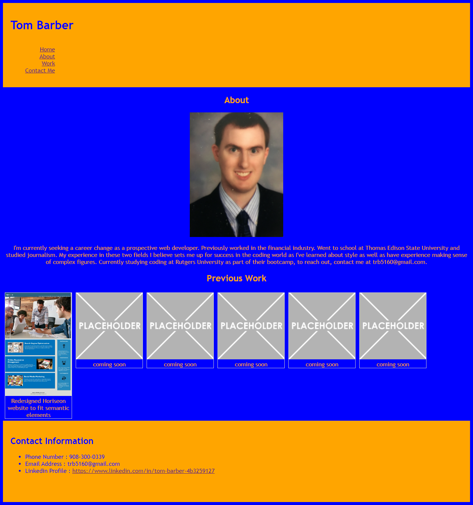

Tom Barber Portfolio

Description:  As a prospective web developer, it is necessary to have a central hub of sorts where I can show off my web creations to prospective employers.  This first iteration of my portfolio website has 3 sections, a short about me section, a gallery of my previous works, and contact information.  I choose to sort my previous works as a gallery, as I felt that it would add a bit of style to the website.  I am happy with how it turned out, however I do worry that it is a bit basic.  The colors blue and orange were chosen because they are the colors of my favorite baseball
team, the New York Mets.  As I become more comfortable with html, css, and javascript, I plan to go back and update my portfolio to give it more flair and have it stand out more.

Website URL: https://trb5160.github.io/TB_Portfolio_Website/
Github URL: https://github.com/trb5160/TB_Portfolio_Website.git

License:

Copyright (c) [2021] [Tom Barber]

Permission is hereby granted, free of charge, to any person obtaining a copy of this software and associated documentation files (the "Software"), to deal in the Software without restriction, including without limitation the rights to use, copy, modify, merge, publish, distribute, sublicense, and/or sell copies of the Software, and to permit persons to whom the Software is furnished to do so, subject to the following conditions:

The above copyright notice and this permission notice shall be included in all copies or substantial portions of the Software.

THE SOFTWARE IS PROVIDED "AS IS", WITHOUT WARRANTY OF ANY KIND, EXPRESS OR IMPLIED, INCLUDING BUT NOT LIMITED TO THE WARRANTIES OF MERCHANTABILITY, FITNESS FOR A PARTICULAR PURPOSE AND NONINFRINGEMENT. IN NO EVENT SHALL THE AUTHORS OR COPYRIGHT HOLDERS BE LIABLE FOR ANY CLAIM, DAMAGES OR OTHER LIABILITY, WHETHER IN AN ACTION OF CONTRACT, TORT OR OTHERWISE, ARISING FROM, OUT OF OR IN CONNECTION WITH THE SOFTWARE OR THE USE OR OTHER DEALINGS IN THE SOFTWARE